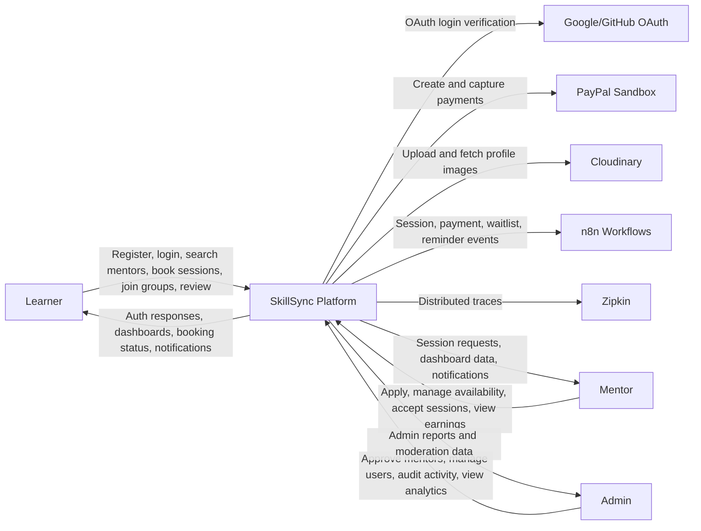
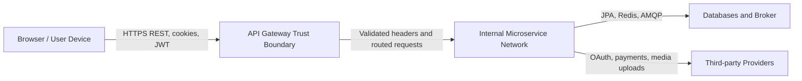

# SkillSync Data Flow Diagram

This DFD describes how data moves through the SkillSync peer learning and mentor matching platform across the frontend, API gateway, microservices, databases, message broker, external providers, and observability tools.

## Level 0 Context Diagram

## Level 1 System DFD

```mermaid
flowchart TB
    subgraph Clients["External Entities"]
        User["Learner / Mentor / Admin"]
        OAuth["Google / GitHub OAuth"]
        PayPal["PayPal Sandbox"]
        Cloudinary["Cloudinary"]
        N8N["n8n Workflows"]
        Zipkin["Zipkin"]
    end

    subgraph Edge["Presentation and Edge"]
        Frontend["React Frontend"]
        Gateway["API Gateway"]
        Eureka["Eureka Discovery"]
        Config["Config Server"]
    end

    subgraph Services["Microservices"]
        Auth["Auth Service"]
        UserSvc["User Service"]
        MentorSvc["Mentor Service"]
        SkillSvc["Skill Service"]
        SessionSvc["Session Service"]
        PaymentSvc["Payment Service"]
        ReviewSvc["Review Service"]
        GroupSvc["Group Service"]
        NotificationSvc["Notification Service"]
        AuditSvc["Audit Service"]
    end

    subgraph Stores["Data Stores"]
        AuthDB[("Auth DB")]
        UserDB[("User DB")]
        MentorDB[("Mentor DB")]
        SkillDB[("Skill DB")]
        SessionDB[("Session DB")]
        PaymentDB[("Payment DB")]
        ReviewDB[("Review DB")]
        GroupDB[("Group DB")]
        NotificationDB[("Notification DB")]
        AuditDB[("Audit DB")]
        Redis[("Redis Cache")]
        RabbitMQ[("RabbitMQ Event Bus")]
    end

    User -->|"UI actions"| Frontend
    Frontend -->|"REST API calls, JWT cookie/header"| Gateway
    Gateway -->|"Route /auth"| Auth
    Gateway -->|"Route /users"| UserSvc
    Gateway -->|"Route /mentors"| MentorSvc
    Gateway -->|"Route /skills"| SkillSvc
    Gateway -->|"Route /sessions"| SessionSvc
    Gateway -->|"Route /payments"| PaymentSvc
    Gateway -->|"Route /reviews"| ReviewSvc
    Gateway -->|"Route /groups"| GroupSvc
    Gateway -->|"Route /notifications"| NotificationSvc
    Gateway -->|"Route /audit"| AuditSvc

    Services -->|"Register and discover services"| Eureka
    Services -->|"Load centralized config"| Config

    Auth <-->|"Users, roles, refresh tokens"| AuthDB
    UserSvc <-->|"Profiles, preferences, user skills"| UserDB
    MentorSvc <-->|"Mentor profiles, availability, waitlist"| MentorDB
    SkillSvc <-->|"Skills and categories"| SkillDB
    SessionSvc <-->|"Holds, sessions, feedback"| SessionDB
    PaymentSvc <-->|"Payments, refunds, payouts, earnings"| PaymentDB
    ReviewSvc <-->|"Reviews and badges"| ReviewDB
    GroupSvc <-->|"Groups, members, messages"| GroupDB
    NotificationSvc <-->|"Notifications"| NotificationDB
    AuditSvc <-->|"Audit logs and analytics"| AuditDB

    Gateway <-->|"Rate limiting"| Redis
    SkillSvc -.->|"Cache, when enabled"| Redis
    MentorSvc -.->|"Cache, when enabled"| Redis

    Auth -->|"User registered event"| RabbitMQ
    MentorSvc -->|"Mentor approved/rejected/waitlist events"| RabbitMQ
    SessionSvc -->|"Session created/confirmed/completed/cancelled events"| RabbitMQ
    PaymentSvc -->|"Payment received/refunded events"| RabbitMQ
    ReviewSvc -->|"Review created events"| RabbitMQ
    RabbitMQ --> NotificationSvc
    RabbitMQ --> AuditSvc
    RabbitMQ --> N8N

    Auth <-->|"OAuth verification"| OAuth
    UserSvc <-->|"Avatar upload and retrieval"| Cloudinary
    PaymentSvc <-->|"Order creation, capture, refund, webhook verification"| PayPal
    Services -->|"Trace spans"| Zipkin
```

## Key Data Stores

| Store | Owner Service | Main Data |
| --- | --- | --- |
| Auth DB | Auth Service | Users, roles, refresh tokens, OAuth identities |
| User DB | User Service | Profiles, preferences, user skills, referrals |
| Mentor DB | Mentor Service | Mentor applications, skills, availability, waitlist |
| Skill DB | Skill Service | Skill categories and active skills |
| Session DB | Session Service | Booking holds, sessions, feedback, status transitions |
| Payment DB | Payment Service | Payment transactions, refunds, payouts, earnings |
| Review DB | Review Service | Reviews, moderation state, badges |
| Group DB | Group Service | Groups, memberships, messages |
| Notification DB | Notification Service | Notification records and read state |
| Audit DB | Audit Service | Audit events and analytics projections |
| Redis | Gateway and selected services | Rate-limit counters and cache entries |
| RabbitMQ | Shared event bus | Cross-service domain events |

## Main Data Flows

1. Authentication: the frontend sends credentials or OAuth tokens to the API Gateway, the Auth Service validates them, stores user/session data in Auth DB, and publishes registration events to RabbitMQ.
2. Mentor discovery: the frontend requests mentors through the gateway, Mentor Service reads mentor profiles from Mentor DB, Skill Service provides skill metadata from Skill DB, and the UI combines them for filtering and display.
3. Booking: the learner selects a mentor, skill, date, and time; Session Service creates a hold and then a session in Session DB with `PAYMENT_PENDING` status.
4. Payment: Payment Service reads the session snapshot from Session Service, creates or bypasses a PayPal order depending on config, records payment data in Payment DB, and marks the session as paid through an internal service call.
5. Notifications and automation: domain events are published to RabbitMQ, consumed by Notification Service, Audit Service, and n8n workflows for notifications, audit trails, reminders, and receipts.
6. Reviews and completion: after a session is completed, Review Service records feedback, Payment Service releases pending earnings, and Audit Service updates analytics projections.

## Trust Boundaries

